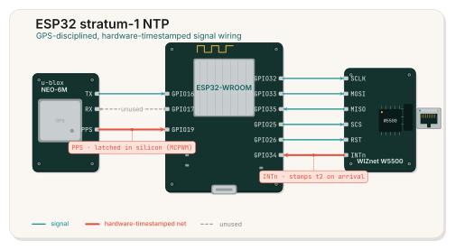

# esp32-ntp: a GPS-disciplined Stratum 1 NTP server for the ESP32

**Writeup:** [Building a GPS stratum 1 NTP server on an ESP32](https://dnim.dev/blog/esp32-stratum-1-ntp)

Turn an ESP32 and a cheap GPS module into a **Stratum 1 NTP time server** that hands out
sub-microsecond-grade time over **Ethernet (WIZnet W5500)** or **Wi-Fi**. PPS edges from the
GPS are captured in hardware, so the clock is disciplined with nanosecond resolution and no
interrupt jitter, and packet timestamps are taken in hardware too, so what clients see on the
wire is just as tight.

If you've ever wanted your own GPS time server, a `chrony`/`ntpd` upstream that doesn't depend
on the public NTP pool, or a self-hosted Stratum 1 reference clock on your LAN, this is a small,
self-contained one that runs directly on an ESP32.

> **Status:** runs unattended for days, self-recovers from faults, and posts sub-microsecond
> served jitter on a wired LAN (numbers and the honest caveats are below).

---

## Highlights

- **Stratum 1 over GPS + PPS.** Time is steered by a PI servo locked to the GPS pulse-per-second
  signal. No internet, no SNTP, no upstream server needed once the GPS has a fix.
- **Hardware PPS capture (MCPWM).** The ESP32's MCPWM capture peripheral latches a counter at the
  exact PPS GPIO edge in silicon: 12.5 ns resolution (80 MHz APB clock), zero ISR-latency jitter.
  The servo, jitter estimator, and outlier rejection all run on hardware-captured ticks.
- **Hardware RX timestamping (W5500 interrupt capture).** Incoming NTP requests are timestamped the
  instant they arrive. The W5500's `INTn` line fires a GPIO interrupt that latches a monotonic
  timestamp, so the receive time (`t2`) reflects true arrival instead of when a poll loop noticed.
  It's the same "capture in hardware, not in software" idea as the PPS path.
- **Transmit-timestamp correction.** The reply's transmit time (`t3`) is pre-corrected by a
  self-calibrating estimate of the W5500 send latency, so it reflects actual wire egress. This
  removes the systematic offset that otherwise makes a polled SPI MAC look hundreds of microseconds
  off.
- **Ethernet or Wi-Fi.** WIZnet W5500 (SPI) or Wi-Fi STA, selected at build time. Same NTP server
  and metrics either way.
- **Prometheus metrics over HTTP** at `GET /metrics`: lock state, offset, jitter, frequency, and a
  full set of health and diagnostics counters.
- **Self-healing for unattended use.** A hardware watchdog reboots on any firmware hang, and a
  W5500 health watchdog restarts the device if the network chip wedges, so it recovers on its own
  with no serial console attached.
- **Optional LED matrix display** (MAX7219) showing the current time, with a top-row binary uptime
  ticker.

## Measured performance

On a wired LAN, judged by a `chrony` instance on a separate wired host:

- **Internal discipline:** last offset around a few ns, RMS offset around 16 ns, PPS jitter around
  7 to 11 ns, zero PPS outliers rejected over tens of thousands of pulses.
- **As a served time source:** per-sample jitter (sigma) around 0.6 to 2.6 us, root distance around
  35 to 65 us, offset within a few tens of us. That was tight enough that `chrony` happily
  **selected the ESP32** alongside other GPS Stratum 1 references, including an Intel i210 plus
  u-blox NEO-M9N PTP grandmaster.

One honest caveat on that comparison: the measuring host was on the same subnet as the ESP32, while
the grandmaster sat one routed hop away. That extra hop inflates the grandmaster's measured delay
and root distance, so this is not an apples-to-apples "beats a grandmaster" result. Read it as the
ESP32 being genuinely in the same class as serious GPS Stratum 1 hardware from where the client was
sitting, not as proof it is more accurate than a PTP grandmaster.

### Cross-checked by the grandmaster itself

The cleaner test runs the comparison the other way around. The i210 plus NEO-M9N grandmaster, using
its own NIC hardware timestamping and interleaved NTP, measures the ESP32 directly. Now the ESP32 is
the source a routed hop away, so the result is conservative rather than flattering.

Seen from the grandmaster, the ESP32 tracks it to within about 60 us of offset (across that one
routed hop), with per-sample jitter on the order of 10 to 25 us, reach 377, and a near-zero
frequency skew. That jitter floor is the ESP32's W5500 and the network path, not the GPS discipline,
which holds to nanoseconds internally. In other words, an independent GPS PTP grandmaster sees the
ESP32 agreeing with it at the tens-of-microseconds level over the LAN, which is what validates the
served time as accurate, not merely internally precise.

Your numbers will depend on antenna placement, GPS module, wiring, and network topology, but the
takeaway holds: the limit is your GPS and your network path, not the ESP32.

## Hardware

<p align="center">
  
</p>

- **MCU:** ESP32 (IDF target `esp32`).
- **GPS:** any UART NMEA module with a PPS output (for example NEO-6M, NEO-M8N, or NEO-M9N). PPS
  goes to any GPIO, including input-only pins 34 to 39, because it's captured by the MCPWM
  peripheral.
- **Ethernet (recommended):** WIZnet W5500 on its own SPI bus (HSPI / SPI2 by default, 20 MHz). Its
  `INTn` pin is wired to a GPIO (default GPIO34) for hardware RX timestamping.
- **Display (optional):** up to 4x MAX7219 8x8 matrices on a separate SPI bus (VSPI / SPI3).

Default pins live in `components/config/config.cpp` and can be overridden in `menuconfig`.

## Bill of materials

Street prices for the clone-grade parts most people actually buy (AliExpress / HiLetgo tier, 2026).

| Part | Role | Typical price |
| --- | --- | --- |
| ESP32 DevKitC / WROOM-32 dev board | MCU, MCPWM capture, servo | $5 |
| NEO-6M GPS module + ceramic antenna | GPS fix and the PPS edge | $6 |
| WIZnet W5500 module (RJ45 + magnetics) | wired Ethernet, hardware timestamping | $7 |
| Jumper wires / small perfboard | wiring | $2 |
| 5V USB supply | power (you probably already own one) | $0 to $3 |
| MAX7219 4-in-1 8x8 matrix (optional) | LED display | $6 |

That is about **$20 for the Ethernet Stratum 1**, or roughly **$26 with the display**. The NEO-6M is
the cheapest module with a PPS pin, which is what makes the $20 number real. A NEO-M8N (around $15)
or NEO-M9N (around $30) tightens the PPS and the fix if you want the best version, pushing the build
to roughly $30 to $45.

For comparison, the usual Raspberry Pi Stratum 1 (Pi plus a GPS HAT plus an SD card) lands around
$90 to $130 and still takes its timestamps in software, so it carries Linux scheduling jitter.
Hobby appliances like LeoNTP run about $300, and commercial GPS Stratum 1 units run from $200 into
the thousands.

What makes this build worth its salt rather than just cheap is the part that costs nothing: the
hardware timestamping. MCPWM capture on the PPS edge, W5500 interrupt capture on packet arrival, and
the transmit correction are what put the served jitter under a microsecond, where a naive $20 build
would sit in the milliseconds.

## Build and flash

Prerequisites:
- ESP-IDF installed (tested with a v6.0-dev toolchain), with `IDF_PATH` set.

```bash
make build          # idf.py build
make flash          # flash firmware (override speed with: make flash BAUD=230400)
make monitor        # open the serial console
make flash-monitor  # flash then monitor
make menuconfig      # open project configuration
```

Or call `idf.py` directly if you prefer.

> **Tip:** if `make flash` drops mid-transfer ("chip stopped responding") on a flaky USB-serial
> bridge, lower the baud: `make flash BAUD=230400`.

## Configuration

Project options live under **`esp32-ntp configuration`** in `menuconfig`:

- **Network**
  - **Network interface:** WIZnet W5500 Ethernet or Wi-Fi STA. IP works the same either way
    (DHCP by default, or static IP/gateway/netmask). Hardware transmit-timing correction is used on
    the W5500 path; Wi-Fi uses the same GPS/PPS discipline over the lwIP stack.
  - **Wi-Fi STA:** set **SSID** and **password**.
- **NTP / timezone**
  - `APP_TZ`: POSIX timezone string. Examples:
    - Eastern US: `EST5EDT,M3.2.0,M11.1.0`
    - Central Europe: `CET-1CEST,M3.5.0,M10.5.0/3`
    - UK: `GMT0BST,M3.5.0/1,M10.5.0/2`
    - Atlantic Canada: `AST4ADT,M3.2.0,M11.1.0`
- **SPI / Display**
  - `APP_USE_DISPLAY` and the MAX7219 SPI host/pinout (`APP_SPI_HOST`, `APP_SPI_MOSI_PIN`,
    `APP_SPI_SCLK_PIN`, `APP_CS_PIN`, `APP_MAX_DEVICES`, `APP_SPI_CLOCK_HZ`).

Ethernet and GPS pin assignments are in `Config::getW5500*` and `Config::getGps*` in
`components/config/config.cpp`.

## Runtime behavior

On boot, `app_main` initializes NVS, brings up the selected network interface (W5500 or Wi-Fi) with
DHCP or static IP, applies the timezone, optionally starts the display task, and then starts GPS/PPS
disciplining, the NTP server, and the stats HTTP server.

**NTP server** (UDP port 123):
- Synthesizes NTP timestamps from the last PPS edge plus a frequency-corrected monotonic timer.
- On the W5500 path: timestamps the request on arrival via the `INTn` interrupt, resolves ARP up
  front, then sends a single reply whose transmit timestamp is pre-corrected for send latency.
- On the Wi-Fi path: a single send through the ESP-IDF lwIP stack.

**Stats / diagnostics HTTP server** (`GET /metrics` on TCP port 8080), Prometheus text format:

| Metric | Meaning |
| --- | --- |
| `ntp_clock_offset_seconds` | Last measured clock offset |
| `ntp_rms_offset_seconds` | Exponentially weighted RMS offset |
| `ntp_frequency_ppm` | Estimated oscillator frequency error |
| `ntp_pps_jitter_seconds` | PPS pulse jitter |
| `ntp_root_dispersion_seconds` | Estimated root dispersion |
| `ntp_gps_lock` | GPS lock state (1 = locked) |
| `ntp_stratum` | NTP stratum (1 when locked) |
| `ntp_uptime_seconds` | Seconds since boot |
| `ntp_requests_total` | NTP requests served |
| `ntp_pps_count` | PPS edges received |
| `ntp_pps_rejects_total` | PPS pulses rejected as outliers |
| `ntp_rx_irq_total` | W5500 RX interrupts captured (hardware arrival edges) |
| `ntp_tx_correction_us` | Self-calibrated transmit-path correction added to `t3` |
| `ntp_reset_reason` | `esp_reset_reason()` of the last boot (1=power-on, 7=task WDT, 8=int WDT, 9=brownout) |
| `ntp_boot_count` | Boots since flash (NVS-persisted, so a jump means it auto-recovered) |
| `ntp_main_loop_beats` | Core-0 main-loop heartbeat |
| `ntp_free_heap_bytes` / `ntp_min_free_heap_bytes` | Current / lowest-ever free heap |
| `ntp_eth_link_up` | W5500 link health |
| `ntp_w5500_version` | W5500 `VERSIONR` (4 = healthy) |

**Self-recovery:** the task watchdog is set to reboot, not just warn, so a firmware hang restarts
the device within seconds. Separately, a W5500 health check restarts the device if the Ethernet chip
or link stays unresponsive. Both are visible after the fact via `ntp_boot_count` and
`ntp_reset_reason`, so you can diagnose a field fault by curling `/metrics` instead of attaching a
cable.

## Code structure

- `main/app_main.cpp`: system bring-up, component wiring, main loop, liveness/boot diagnostics.
- `components/config`: pinout and configuration accessors (`Config::...`).
- `components/gps`: NMEA parsing and PPS discipline (MCPWM hardware capture, PI servo, outlier
  rejection).
- `components/ntp_server`: NTP server over W5500 UDP or Wi-Fi UDP, with hardware RX timestamping and
  transmit-timestamp correction.
- `components/ntp_stats`: HTTP `/metrics` server over W5500 TCP or Wi-Fi TCP.
- `components/w5500_eth`: W5500 SPI driver, DHCP/static IP, PHY setup, and the link/health watchdog.
- `components/wifi_sta`: Wi-Fi STA with DHCP or static IP.
- `components/w5k`: thin UDP/TCP wrapper over the WIZnet ioLibrary sockets.
- `components/display`: MAX7219 display driver and rendering.
- `ioLibrary_Driver`: WIZnet W5x00 reference driver (git submodule, licensed separately by WIZnet).

## License

All original code in this repository is licensed under **MIT No Attribution (MIT-0)**, see `LICENSE`.
The `ioLibrary_Driver` submodule and other bundled third-party components retain their own upstream
licenses.
