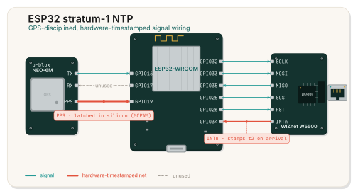

# esp32-ntp: a GPS-disciplined Stratum 1 NTP server for the ESP32

**Writeup:** [Building a GPS stratum 1 NTP server on an ESP32](https://dnim.dev/blog/esp32-stratum-1-ntp)

An ESP32 plus a cheap GPS module, serving Stratum 1 NTP over Ethernet (WIZnet W5500) or
Wi-Fi. PPS edges are captured by the MCPWM peripheral in silicon and packet arrival is
timestamped off the W5500 interrupt, so neither the discipline nor the served timestamps
depend on when a poll loop noticed.

Configuration lives in flash and is edited from a page the device serves itself, so a
deployed clock needs no rebuild and no serial cable. See [Configuration](#configuration).

## What it does

- **Stratum 1 from GPS + PPS.** No internet or upstream server once the GPS has a fix.
- **Hardware timestamping both ways.** MCPWM capture for PPS (12.5 ns resolution at
  80 MHz), W5500 `INTn` capture for NTP arrival.
- **Interleaved mode (RFC 9769).** Clients that ask for it get the measured transmit time
  of the previous reply rather than a predicted one. Invisible to clients that do not.
- **Ethernet or Wi-Fi**, switchable at runtime. The Wi-Fi path compiles out on parts with
  no radio.
- **Settings in flash, edited from a browser**, with a permanent lock for deployment and a
  recovery path if a setting locks you out.
- **Prometheus metrics** at `GET /metrics`.
- **Self-healing:** task watchdog reboots on a hang, and a W5500 health check restarts the
  device if the network chip wedges.
- **Optional MAX7219 LED display.**

## Accuracy

Measured against independent GPS references on the same LAN. Two figures matter and they
are different things:

| | |
|---|---|
| Internal discipline (against its own PPS) | single-digit ns offset, 7 to 11 ns PPS jitter |
| Served time (what a client actually sees) | tens of us, dominated by the network path |

The gap between those two is not the clock. It is the W5500 at 100 Mbit and whatever sits
between the board and the client. A gigabit observer one switch away measured this
firmware at -11.2 us before calibration and within about 100 ns after, with roughly 3 us of
that figure attributable to the 100 Mbit to gigabit speed transition rather than to the
board.

Independent cross-checks: an Intel i210 plus NEO-M9N PTP grandmaster, measuring the ESP32
one routed hop away with its own NIC hardware timestamping, saw about 60 us of offset and
10 to 25 us of per-sample jitter. Separately, in a four-clock ensemble (two NIC-PHC clocks,
a BeagleBone PRU clock and this ESP32), three chrony observers each running full source
selection accept the ESP32 as a truechimer against the other three.

Your numbers depend on your GPS, your antenna, your wiring and your network. The limit is
almost always one of those rather than the ESP32.

## Hardware

<p align="center">
  
</p>

- **MCU:** the original ESP32 (IDF target `esp32`). 2 MB of flash is enough; the app partition is
  1.9 MB and about half free.

  Three SoC capabilities decide whether a part in the family can run this at all. **MCPWM**, because
  the PPS edge is latched by the capture submodule (capture is not separately gated: ESP-IDF builds
  `mcpwm_cap.c` on `SOC_MCPWM_SUPPORTED` alone, and the capture registers are present in every
  MCPWM-bearing target). **Two usable SPI hosts**, because SPI1 is tied to flash and the W5500 and
  the display each need their own bus, so `SOC_SPI_PERIPH_NUM` has to be 3. WiFi is **not** a
  requirement: the WiFi path compiles itself out on parts without a radio, so those still build and
  simply have no WiFi option. Checked against `soc_caps.h` in ESP-IDF v6.0.2:

  | Target | MCPWM | Usable SPI | WiFi | Verdict |
  |---|---|---|---|---|
  | **ESP32** | yes | 2 | yes | **Supported. The only part built and measured.** |
  | **ESP32-S3** | yes | 2 | yes | **Meets every requirement. Never built here.** |
  | ESP32-C5 | yes | 1 | yes | Only without the display, one bus for the W5500 |
  | ESP32-C6 | yes | 1 | yes | Only without the display, one bus for the W5500 |
  | ESP32-S2 | no | 2 | yes | Impossible, no MCPWM |
  | ESP32-C2 | no | 1 | yes | Impossible, no MCPWM |
  | ESP32-C3 | no | 1 | yes | Impossible, no MCPWM |
  | ESP32-C61 | no | 1 | yes | Impossible, no MCPWM |
  | ESP32-H4 | yes | 2 | no | Builds, Ethernet only, no WiFi option |
  | ESP32-P4 | yes | 2 | no | Builds, but do not: see below |
  | ESP32-H2 | yes | 1 | no | Ethernet only, and no bus left for the display |
  | ESP32-H21 | yes | 1 | no | Ethernet only, and no bus left for the display |

  The four "impossible" rows have no MCPWM and no path forward. Everything else builds from the same
  source with no configuration change; dropping the WiFi path saves about 488 KB of flash where it
  is not available. Anything other than the ESP32 also needs the pin map revisited, which assumes
  ESP32 GPIO numbering and its input-only 34 to 39, and none of them have been built or measured
  here.

  **The ESP32-P4 is a special case: it builds, and you should not.** It is the one part in the
  family whose Ethernet MAC does IEEE 1588v2 hardware timestamping
  (`SOC_EMAC_IEEE1588V2_SUPPORTED`), so the packet timestamps this project works so hard to
  approximate with a W5500 and an interrupt edge are simply available in silicon. Bolting an SPI NIC
  onto a P4 would be strictly worse than using its own MAC, and it is a far more expensive part.
  That gap is also the reason the W5500 exists here at all: the original ESP32 has an EMAC, but
  without 1588 support, so an external MAC whose `INTn` marks arrival is the closest thing to a
  hardware receive timestamp this silicon can offer.
- **Toolchain:** ESP-IDF **v6.0**. Earlier versions predate the split driver components
  (`esp_driver_gpio`, `esp_driver_uart`, `esp_driver_spi`, `esp_driver_mcpwm`) that this project
  requires, so they fail at configure time rather than building something subtly wrong. CI builds
  v6.0.2 from a clean clone.
- **Crystal:** the build pins 40 MHz (`CONFIG_XTAL_FREQ`); some modules ship with a 26 MHz crystal
  instead, and the tell is garbage on the serial console at 115200. If that's your board, change
  `CONFIG_XTAL_FREQ` in `menuconfig`.
- **GPS:** any UART NMEA module with a PPS output (for example NEO-6M, NEO-M8N, or NEO-M9N). PPS
  goes to any GPIO, including input-only pins 34 to 39, because it's captured by the MCPWM
  peripheral.
- **Ethernet (recommended):** WIZnet W5500 on its own SPI bus (HSPI / SPI2 by default, 20 MHz). Its
  `INTn` pin is wired to a GPIO (default GPIO34) for hardware RX timestamping.
- **Display (optional):** up to 4x MAX7219 8x8 matrices on a separate SPI bus (VSPI / SPI3).
- **DS3231 RTC (optional):** any DS3231 breakout on I2C (any two GPIOs), 3.3 V, with its coin
  cell fitted. It does two independent jobs. The battery-backed time seeds the system clock at
  boot (display and logs are right immediately; NTP still waits for GPS) and is written back
  from GPS at most daily, or when it has drifted. Wiring the board's **32K pad** to a third GPIO
  is the interesting part: that pin carries the DS3231's ±2 ppm temperature-compensated
  oscillator directly, and it lands on the last MCPWM capture channel, sharing the 80 MHz
  counter with PPS and `INTn`. The crystal is then measured against the TCXO continuously, so
  GPS holdover stops coasting on a frozen frequency estimate: the crystal's thermal drift is
  observed live, and the TCXO's own residual error is learned against GPS per 0.5 °C of its die
  temperature while locked (persisted in NVS, at most one ~1.5 KB write per hour). Holdover
  dispersion then grows at the learned residual (floored at 0.05 ppm) instead of quadratically,
  and the holdover budget stretches from 1 h to 24 h. The TCXO also flywheels the PPS while
  locked: served anchors sit at a smoothed pulse position (~30 s averaging), so served phase
  carries ~1.5 ns of receiver jitter instead of each pulse's ~10 ns; the filter stands down by
  itself during fast temperature ramps. Skip the part entirely and nothing changes: all three
  pins default to `-1`.

Default pins live in `components/config/config.cpp` and can be overridden in `menuconfig`.

## Bill of materials

Street prices for the clone-grade parts most people actually buy (AliExpress / HiLetgo tier, 2026).

| Part | Role | Typical price |
| --- | --- | --- |
| ESP32 DevKitC / WROOM-32 dev board | MCU, MCPWM capture, servo | $5 |
| NEO-6M GPS module + ceramic antenna | GPS fix and the PPS edge | $6 |
| WIZnet W5500 module (RJ45 + magnetics) | wired Ethernet, hardware timestamping | $7 |
| Jumper wires / small perfboard | wiring | $2 |
| 5V USB supply | power (you probably already own one) | $0 to $3 |
| MAX7219 4-in-1 8x8 matrix (optional) | LED display | $6 |
| DS3231 breakout + coin cell (optional) | battery-backed boot time, TCXO holdover reference | $2 |

The MCU row means the original ESP32 specifically. See **Hardware** above for which parts in the
family can and cannot run this, and why.

That is about **$20 for the Ethernet Stratum 1**, or roughly **$26 with the display**. The NEO-6M is
the cheapest module with a PPS pin, which is what makes the $20 number real. A NEO-M8N (around $15)
or NEO-M9N (around $30) tightens the PPS and the fix if you want the best version, pushing the build
to roughly $30 to $45.

For comparison, the usual Raspberry Pi Stratum 1 (Pi plus a GPS HAT plus an SD card) lands around
$90 to $130 and still takes its timestamps in software, so it carries Linux scheduling jitter.
Hobby appliances like LeoNTP run about $300, and commercial GPS Stratum 1 units run from $200 into
the thousands.

What makes this build worth its salt rather than just cheap is the part that costs nothing: the
hardware timestamping. MCPWM capture on the PPS edge, W5500 interrupt capture on packet arrival, and
the transmit correction are what put the served jitter under a microsecond, where a naive $20 build
would sit in the milliseconds.

## Build and flash

Prerequisites:
- ESP-IDF v6.0 installed, with `IDF_PATH` set. CI builds v6.0.2; earlier versions do not have the
  split driver components this project requires.

```bash
make build          # idf.py build
make flash          # flash firmware (override speed with: make flash BAUD=230400)
make monitor        # open the serial console
make flash-monitor  # flash then monitor
make menuconfig      # open project configuration
```

Or call `idf.py` directly if you prefer.

> **Tip:** if `make flash` drops mid-transfer ("chip stopped responding") on a flaky USB-serial
> bridge, lower the baud: `make flash BAUD=230400`.

## Configuration

Settings live in flash and are edited from the device's own web page. Everything below can also be
set at build time in `menuconfig`, and those build-time values are what an unconfigured device runs
on, so a freshly flashed board comes up exactly as it always did.

### Settings page

Point a browser at the device on the management port (`8080` by default):

```
http://<device-ip>:8080/
```

Everyday settings are on the page directly: network interface, DHCP or a static address, timezone
(a dropdown of common zones, not a raw POSIX string), the display toggles, the management port, and
an optional password. Wiring settings (every GPIO, SPI host, SPI clock, the GPS UART and the PPS
pin) sit behind an **Advanced** disclosure, because a wrong pin there takes the clock off the
network on the next restart.

Saving writes only the fields you changed and reboots. Values are validated before anything reaches
flash, so an out-of-range pin or a malformed IP is refused with nothing written. Fields marked `*`
need the restart to take effect.

Set a password under **System** unless the network is fully trusted: without one, anyone who can
reach the address can reconfigure or reboot the clock. `/metrics` stays unauthenticated either way
so Prometheus can scrape it.

### Locking it down

Once a clock is configured and in service, the settings page is pure attack surface. Two controls,
in increasing severity:

**Password.** Set one under **System**. It applies to the settings page only; `/metrics` stays open
so Prometheus can scrape without credentials.

**Lock settings permanently.** A fuse. Saving it removes the settings page, `GET /` and
`/config` and `POST /config` all answer `403`, and so does `/factory-reset`, because a reset that
cleared the lock would not be a lock. What survives is NTP on port 123 and `/metrics`, which is
everything a deployed clock actually needs.

It is one way. Nothing over the network undoes it, and neither does the safe-mode path below: safe
mode reads the lock straight out of NVS rather than from the settings it is ignoring, so a bad
config still recovers while the page stays shut. The only way back is physical, erasing the NVS
partition over USB:

```bash
esptool --port /dev/ttyUSB0 erase-region 0x9000 0x6000
```

That takes every stored setting with it and the device returns to build-time defaults.

Locking needs a password set first, which only stops you doing it by accident. Anyone who can
reach an unprotected page owns the device, fuse included.

### If a setting makes the device unreachable

Interrupt startup twice, with the reset button or the power lead. The third boot ignores stored
settings and comes up on the build-time defaults, with a banner on the settings page explaining
why. Your stored values are still in flash and are not touched; saving from that page overwrites
them, and any restart that reaches the network clears the condition on its own.

**Erase stored settings** at the bottom of the page wipes everything back to build-time defaults.

### Settings reference

Every runtime setting, generated from the single table in
`components/config/config_store.c`. **R** means the change takes effect on restart,
**A** means it sits behind the Advanced disclosure on the settings page.

#### Network

| Key | Type | Range | Flags | Setting |
|---|---|---|---|---|
| `net.mode` | choice | `wiznet` / `wifi` | R | Interface. `wifi` is absent on parts with no radio. |
| `net.dhcp` | bool | 0 / 1 | R | Use DHCP. Off means the three fields below are used. |
| `net.ip` | text |  | R | Static IP |
| `net.gw` | text |  | R | Gateway |
| `net.mask` | text |  | R | Netmask |
| `wifi.ssid` | text |  | R | WiFi SSID. Only used when the interface is WiFi. |
| `wifi.pass` | password |  | R | WiFi password |

#### System

| Key | Type | Range | Flags | Setting |
|---|---|---|---|---|
| `sys.tz` | text |  |  | Timezone. Affects the LED display only. NTP always serves UTC. |
| `stats.port` | int | `1`..`65535` | R | Management port. This page and /metrics. |
| `ui.pass` | password |  |  | Management password. Blank leaves this page open to anyone on the network. |
| `ui.lock` | bool | 0 / 1 |  | Lock settings permanently. One way. Saving this removes the settings page for good; only erasing  |

#### Display

| Key | Type | Range | Flags | Setting |
|---|---|---|---|---|
| `disp.en` | bool | 0 / 1 | R | Enable display |
| `disp.glyph` | bool | 0 / 1 |  | Show presync glyph. Marker shown until the GPS locks. |

#### Service

| Key | Type | Range | Flags | Setting |
|---|---|---|---|---|
| `ntp.port` | int | `1`..`65535` | R A | NTP port. 123 is the standard. Clients will not find it anywhere else. |
| `serve.cal` | int | `-100000`..`100000` | A | Serve calibration (us). Subtracted from t2 and t3. Re-derive before changing. |

#### Display wiring

| Key | Type | Range | Flags | Setting |
|---|---|---|---|---|
| `disp.host` | int | `1`..`2` | R A | SPI host. 1 = SPI2, 2 = SPI3. Must differ from the W5500 host. |
| `disp.cs` | int | `-1`..`33` | R A | CS pin |
| `disp.mosi` | int | `-1`..`33` | R A | MOSI pin |
| `disp.sclk` | int | `-1`..`33` | R A | SCLK pin |
| `disp.hz` | int | `100000`..`20000000` | R A | SPI clock (Hz) |
| `disp.ndev` | int | `1`..`16` | R A | Cascaded modules |

#### W5500 wiring

| Key | Type | Range | Flags | Setting |
|---|---|---|---|---|
| `w5.host` | int | `1`..`2` | R A | SPI host. 1 = SPI2, 2 = SPI3. Must differ from the display host. |
| `w5.cs` | int | `-1`..`33` | R A | CS pin |
| `w5.mosi` | int | `-1`..`33` | R A | MOSI pin |
| `w5.miso` | int | `-1`..`39` | R A | MISO pin |
| `w5.sclk` | int | `-1`..`33` | R A | SCLK pin |
| `w5.int` | int | `-1`..`39` | R A | INT pin. Hardware RX timestamping depends on this. |
| `w5.rst` | int | `-1`..`33` | R A | RST pin |
| `w5.hz` | int | `1000000`..`20000000` | R A | SPI clock (Hz). 20 MHz is the proven ceiling on GPIO-matrix pins. Reads corrupt silently above it. |

#### GPS wiring

| Key | Type | Range | Flags | Setting |
|---|---|---|---|---|
| `gps.uart` | int | `0`..`2` | R A | UART port |
| `gps.rx` | int | `-1`..`39` | R A | RX pin (GPS TX) |
| `gps.tx` | int | `-1`..`33` | R A | TX pin |
| `gps.baud` | int | `1200`..`921600` | R A | Baud rate |
| `pps.gpio` | int | `-1`..`39` | R A | PPS pin. Hardware-captured by MCPWM. The whole clock rides on this. |
| `pps.cal` | int | `-1000000`..`1000000` | A | PPS calibration (us) |

#### DS3231 wiring

| Key | Type | Range | Flags | Setting |
|---|---|---|---|---|
| `rtc.sda` | int | `-1`..`33` | R A | SDA pin. -1 = no DS3231 fitted. With one: battery-backed time at boot. |
| `rtc.scl` | int | `-1`..`33` | R A | SCL pin |
| `rtc.32k` | int | `-1`..`39` | R A | 32kHz pin. TCXO output, captured as the holdover frequency reference. -1 = not wired. |

`net.mode` is a choice between the W5500 Ethernet path and Wi-Fi STA. `pps.cal` and
`serve.cal` are microsecond trims: `pps.cal` shifts the PPS reference, `serve.cal` is
subtracted from both `t2` and `t3` on the way out. Both default to a value measured on the
reference wiring, so re-derive them if yours differs.

Adding a setting means adding one row to that table. The settings page renders and parses
itself from it, so there is no second place to update.

### Build-time defaults

Project options live under **`esp32-ntp configuration`** in `menuconfig`:

- **Network**
  - **Network interface:** WIZnet W5500 Ethernet or Wi-Fi STA. IP works the same either way
    (DHCP by default, or static IP/gateway/netmask). Hardware transmit-timing correction is used on
    the W5500 path; Wi-Fi uses the same GPS/PPS discipline over the lwIP stack.
  - **Wi-Fi STA:** set **SSID** and **password**.
- **NTP / timezone**
  - `APP_TZ`: POSIX timezone string. Examples:
    - Eastern US: `EST5EDT,M3.2.0,M11.1.0`
    - Central Europe: `CET-1CEST,M3.5.0,M10.5.0/3`
    - UK: `GMT0BST,M3.5.0/1,M10.5.0/2`
    - Atlantic Canada: `AST4ADT,M3.2.0,M11.1.0`
- **SPI / Display**
  - `APP_USE_DISPLAY` and the MAX7219 SPI host/pinout (`APP_SPI_HOST`, `APP_SPI_MOSI_PIN`,
    `APP_SPI_SCLK_PIN`, `APP_CS_PIN`, `APP_MAX_DEVICES`, `APP_SPI_CLOCK_HZ`).

The full set of runtime settings, their valid ranges and their build-time defaults are declared in
one table in `components/config/config_store.c`; adding a setting means adding a row there, and the
settings page renders and parses itself from it.

## Runtime behavior

On boot, `app_main` initializes NVS, brings up the selected network interface (W5500 or Wi-Fi) with
DHCP or static IP, applies the timezone, optionally starts the display task, and then starts GPS/PPS
disciplining, the NTP server, and the stats HTTP server.

**DHCP** on the W5500 path caches the bound lease in flash and reclaims it on the next start
(RFC 2131 INIT-REBOOT) rather than rediscovering from scratch. The address is programmed before the
server confirms it, so a restart while the DHCP server is unreachable still comes back on the last
known-good address instead of a fallback; a NAK hands it straight back and triggers a full
discovery. Only the address, gateway, netmask and server identity are cached, and only rewritten
when those change, so renewals never touch flash. Time from link-up to a usable address is about a
second, since the first frame after link-up is routinely lost while the switch port settles and the
retry backs off 1 s, 2 s, then 4 s rather than waiting 4 s to notice.

**NTP server** (UDP port 123):
- Synthesizes NTP timestamps from the last PPS edge plus a frequency-corrected monotonic timer.
- On the W5500 path: timestamps the request on arrival via the `INTn` interrupt, resolves ARP up
  front, then sends a single reply whose transmit timestamp is pre-corrected for send latency.
- On the Wi-Fi path: a single send through the ESP-IDF lwIP stack.

**Stats / diagnostics HTTP server** (`GET /metrics` on TCP port 8080), Prometheus text format:

| Metric | Meaning |
| --- | --- |
| `ntp_clock_offset_seconds` | Last measured clock offset |
| `ntp_rms_offset_seconds` | Exponentially weighted RMS offset |
| `ntp_frequency_ppm` | Estimated oscillator frequency error |
| `ntp_pps_jitter_seconds` | PPS pulse jitter |
| `ntp_root_dispersion_seconds` | Estimated root dispersion |
| `ntp_gps_lock` | GPS lock state (1 = locked) |
| `ntp_stratum` | NTP stratum (1 when locked) |
| `ntp_uptime_seconds` | Seconds since boot |
| `ntp_requests_total` | NTP requests served |
| `ntp_pps_count` | PPS edges received |
| `ntp_pps_rejects_total` | PPS pulses rejected as outliers |
| `ntp_rx_irq_total` | W5500 RX interrupts captured (hardware arrival edges) |
| `ntp_tx_correction_us` | Self-calibrated transmit-path correction added to `t3` (basic mode only) |
| `ntp_interleaved_served_total` | Replies answered in interleaved mode (RFC 9769) |
| `ntp_reset_reason` | `esp_reset_reason()` of the last boot (1=power-on, 7=task WDT, 8=int WDT, 9=brownout) |
| `ntp_boot_count` | Boots since flash (NVS-persisted, so a jump means it auto-recovered) |
| `ntp_main_loop_beats` | Core-0 main-loop heartbeat |
| `ntp_free_heap_bytes` / `ntp_min_free_heap_bytes` | Current / lowest-ever free heap |
| `ntp_eth_link_up` | W5500 link health |
| `ntp_w5500_version` | W5500 `VERSIONR` (4 = healthy) |
| `ntp_rtc_present` | DS3231 fitted and answering (-1 = not configured) |
| `ntp_rtc_temp_celsius` | DS3231 die temperature |
| `ntp_tcxo_err_ppm` | Measured TCXO error against GPS |
| `ntp_tcxo_residual_ppm` | Error of the learned TCXO correction; holdover dispersion grows at this rate |
| `ntp_pps_vs_tcxo_ns` / `_rms_ns` | Each PPS against the TCXO tick stream: pulse quality with no local oscillator in the loop |

**Self-recovery:** the task watchdog is set to reboot, not just warn, so a firmware hang restarts
the device within seconds. Separately, a W5500 health check restarts the device if the Ethernet chip
or link stays unresponsive. Both are visible after the fact via `ntp_boot_count` and
`ntp_reset_reason`, so you can diagnose a field fault by curling `/metrics` instead of attaching a
cable.

## Code structure

- `main/app_main.cpp`: system bring-up, component wiring, main loop, liveness/boot diagnostics.
- `components/config`: pinout and configuration accessors (`Config::...`).
- `components/gps`: NMEA parsing and PPS discipline (MCPWM hardware capture, PI servo, outlier
  rejection).
- `components/ntp_server`: NTP server over W5500 UDP or Wi-Fi UDP, with hardware RX timestamping and
  transmit-timestamp correction.
- `components/webui`: the HTTP server the device runs on itself. `web_server.cpp` is transport,
  request assembly, routing and auth; `web_metrics.cpp` renders `/metrics`; `web_config.cpp`
  renders and parses the settings page.
- `components/w5500_eth`: W5500 SPI driver, DHCP/static IP, PHY setup, and the link/health watchdog.
- `components/wifi_sta`: Wi-Fi STA with DHCP or static IP.
- `components/w5k`: latency-tuned UDP/TCP wrappers over the W5500 driver for the NTP reply path.
- `components/display`: MAX7219 display driver and rendering.

## License

All code in this repository is released into the public domain under **The Unlicense**, see `LICENSE`.
